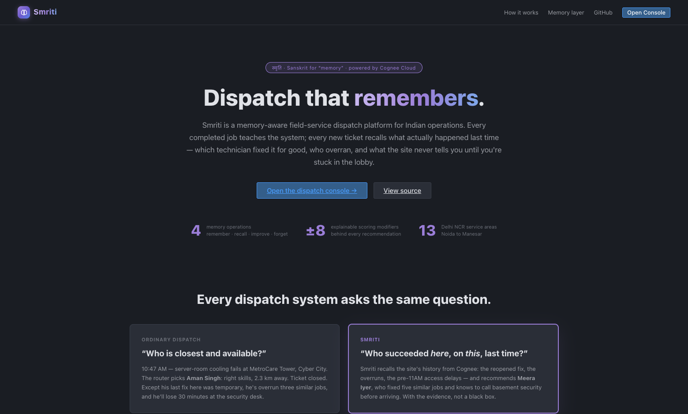
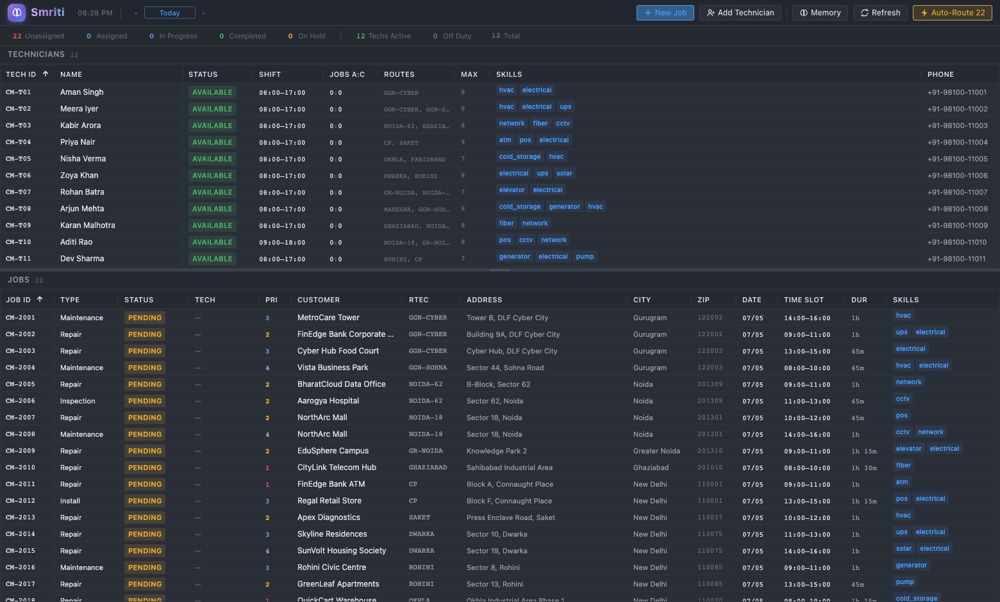
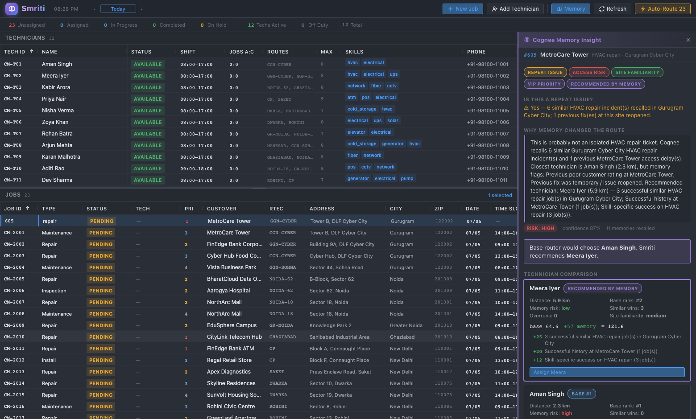

# Smriti — dispatch that remembers

**Smriti** (स्मृति, Sanskrit: *memory*) is a memory-aware field-service
dispatch platform for Indian operations. Its decision layer is powered by
**[Cognee Cloud](https://www.cognee.ai)** — every job teaches the system,
and every routing decision recalls what actually happened last time.

> Built for the Cognee **"The Hangover Part AI"** hackathon —
> **Best Use of Cognee Cloud** track.





---

## The problem

Every dispatch system answers the same question:

> "Who is **closest and available**?"

Smriti answers a better one:

> "Who is closest, available, **historically successful on this exact job
> type**, **familiar with this customer/site**, **unlikely to overrun**, and
> **not repeating a past failed assignment pattern**?"

### The demo story (Delhi NCR)

At **10:47 AM**, a VIP emergency lands: **HVAC failure at MetroCare Tower,
Cyber City, Gurugram** — *"Server room temperature rising; previous cooling
issue returned."*

| | Base router | Memory-aware router |
|---|---|---|
| Pick | **Aman Singh** — 2.3 km, closest qualified | **Meera Iyer** — 5.9 km |
| Why | Distance + skills only | Cognee recalls: Aman **overran 3 similar HVAC jobs** in Cyber City and his last MetroCare fix was **temporary (★2)**. Meera fixed **5 similar Cyber City HVAC jobs**, knows this site, and knows to **call basement security before 11 AM** to avoid the site's access delays. |


*Job intake: the dispatcher creates the ticket via **+ New Job** and the
Memory Insight panel opens with live Cognee recall — base router picks Aman
Singh; memory recommends Meera Iyer, with the full scoring breakdown.*

---

## Architecture

```
React dispatch console (Vite, :5173)
  ├─ Dispatch grids, drag-and-drop assignment
  ├─ New Job / Add Technician intake forms (map location picker)
  ├─ Cognee Memory Insight panel
  └─ Override / completion-learning modals
        │  /api/v1  (Vite dev proxy)
FastAPI backend (:8000)
  ├─ jobs / technicians / assignments / routing (base dispatch)
  ├─ /routing/memory-aware-route
  ├─ /memory/* — status, seed, insights, scorecard,
  │              improve, override, forget, events
  ├─ /demo/*   — seed-india, inject-vip, reset (API-only helpers)
  └─ services/cognee_memory.py ──────────────► Cognee Cloud
        │                                      (remember / recall /
  PostgreSQL (or SQLite fallback)               improve / forget)
   ├─ operational data (jobs, techs, assignments)
   └─ memory_events audit log
```

**Cognee dataset layout** (enables the privacy story):

- `crewmind_ops_patterns` — anonymized operational patterns (site redacted)
- `crewmind_customer_<slug>` — full customer/site-specific memories; the
  forget demo deletes exactly this dataset

**Memory scoring model** (applied on top of the base distance score):

| Modifier | Points |
|---|---|
| Successful similar jobs in same route area | **+25** |
| Successful history at same site/customer | **+20** |
| Skill-specific success for required job type | **+12** |
| Repeated overruns on same job type | **−30** |
| Previous customer complaint at same site | **−25** |
| Previous fix was temporary / reopened | **−20** |
| Unknown technician on a VIP job | **−15** |
| Site has access-delay memory, tech unfamiliar | **−10** |

---

## Setup from scratch

### 0. Prerequisites

| Tool | Version | Check |
|---|---|---|
| Python | 3.12+ | `python3 --version` |
| Node.js | 18+ | `node --version` |
| Docker Desktop | any recent | `docker --version` *(optional — SQLite fallback exists)* |
| A Cognee Cloud account | — | https://platform.cognee.ai |

### 1. Clone and install

```bash
git clone https://github.com/rohanmalhotracodes/smriti.git
cd crewmind-cloud

make setup
# = python3 -m venv .venv
#   .venv/bin/pip install -r requirements.txt
#   (cd frontend && npm install)
#   cp .env.example .env
```

No `make`? Run the four commands in the comment above manually.

### 2. Configure Cognee Cloud

1. Sign in at **https://platform.cognee.ai** → **API Keys** → create a key.
2. Edit `.env`:

```bash
COGNEE_ENABLED=true
COGNEE_API_KEY=<paste your key>
COGNEE_CLOUD_URL=https://api.aws.cognee.ai
```

That's it — on startup the backend asks Cognee's management API for your
tenant's service instance URL and routes all `remember / recall / improve /
forget` calls there via `cognee.serve()`.

**No key?** The dispatch console still runs fully; every `/api/v1/memory/*`
endpoint returns a clear configuration error. There is deliberately no fake
memory fallback.

### 3. Database

**Option A — PostgreSQL via Docker (recommended):**

```bash
make db          # docker compose up -d postgres  (publishes localhost:5432)
```

**Option B — SQLite, zero dependencies:** edit `.env`:

```bash
DATABASE_URL=sqlite:///./crewmind.db
```

Tables are created automatically on first start.

### 4. Run

```bash
make dev         # backend :8000 + frontend :5173 together
```

Or in two terminals:

```bash
.venv/bin/python -m uvicorn backend.api.main:app --reload --port 8000
cd frontend && npm run dev
```

| Service | URL |
|---|---|
| **Product homepage** | **http://localhost:5173** |
| **Dispatch console** | **http://localhost:5173/console** |
| API + Swagger docs | http://localhost:8000/docs |

On startup the backend prints `🧠 Cognee memory layer connected` when the
cloud link is up.

### 5. Seed the memory (one time)

Dispatch data (12 technicians, 25 jobs across Delhi NCR) is seeded
**automatically** the first time the backend starts on an empty database —
the console opens populated.

The historical memory lives in Cognee Cloud and is seeded once:

```bash
make seed-memory     # 41 historical memories → Cognee Cloud
                     # (runs the knowledge-graph pipeline — allow a few minutes)
```

Re-seeding dispatch data later (optional): `make seed-india` — it never
touches the Cognee memory.

---

## Live demo runbook (~2 minutes)

Prerequisite: memory seeded (above); the backend startup log shows
`🧠 Cognee memory layer connected`. The flow is the product's real
dispatcher workflow — no demo buttons.

1. **A VIP ticket comes in.** Click **+ New Job** → customer:
   *MetroCare Tower* → issue: *HVAC failure (electrical)* → priority:
   *VIP / Emergency* → symptoms: *"Server room temperature rising; previous
   cooling issue returned"* → **Create job**.
2. The job lands in the grid as priority-1 pending — and the **Memory
   Insight panel opens automatically** as part of intake, running a live
   `cognee.recall()`.
3. Say: *"Any normal dispatch system sends **Aman Singh** — closest
   qualified, 2.3 km."* The panel disagrees: *"Base router would choose
   Aman Singh. Smriti recommends Meera Iyer."*
4. Walk the panel top-to-bottom:
   - **Repeat Issue / Access Risk / VIP Priority** badges
   - *Why memory changed the route* — the recalled evidence
   - Technician comparison with the ±point scoring breakdown
     (Aman: overruns, poor rating, temporary fix · Meera: similar wins,
     site familiarity)
   - Suggested dispatcher note: *"Call basement security desk before
     arrival; ask for server room access card."*
5. Click **Assign Meera** — or drag the job onto Aman's row instead to
   trigger the *"Why are you overriding?"* modal (the reason is remembered
   by Cognee and scored against the job's real outcome later).
6. Right-click the job → **Complete** → outcome form (54 min, permanent fix,
   ★5) → toast: *"Cognee learned from this job."*
7. Memory panel → **Privacy** → **Forget customer memory** — live
   `cognee.forget()` deletes MetroCare's dataset; anonymized aggregate
   patterns survive.

Close with: *"Smriti doesn't just route the nearest technician — it
remembers what actually happened last time."*

Also worth showing: **+ Add Technician** onboards a new tech (skills,
coverage areas, shift) — on a VIP job, memory flags them as unproven
(−15) until they build history.

---

## Troubleshooting

| Symptom | Fix |
|---|---|
| `SSL: CERTIFICATE_VERIFY_FAILED` calling Cognee | Handled automatically (the app points Python at certifi's CA bundle). If it recurs: `export SSL_CERT_FILE=$(.venv/bin/python -c "import certifi; print(certifi.where())")` |
| `Cognee operation failed … 404 Not Found` | Your `COGNEE_CLOUD_URL` points at the management API — leave it as `https://api.aws.cognee.ai`; the backend auto-discovers your tenant instance. Restart the backend after editing `.env`. |
| Memory endpoints return 503 | `COGNEE_API_KEY` missing, or the backend was started before you added it — edit `.env`, restart the backend. |
| `Connection refused` to Postgres | `make db` (Docker Desktop must be running), or switch to the SQLite `DATABASE_URL`. |
| Port already in use | `pkill -f "uvicorn backend.api.main"` / `pkill -f vite`, then `make dev`. |
| Memory button says "Select a job first" | Click a job row in the grid, then **Memory**. (It opens automatically after creating a job.) |

---

## API reference (memory layer)

| Method | Endpoint | Purpose |
|---|---|---|
| GET | `/api/v1/memory/status` | Cognee config status + last successful op |
| POST | `/api/v1/memory/seed-india` | Seed historical memories into Cognee |
| POST | `/api/v1/memory/jobs/{id}/remember` | Manually remember a job event |
| GET | `/api/v1/memory/jobs/{id}/insights` | Memory Insight panel payload |
| GET | `/api/v1/memory/jobs/{id}/technicians/{tid}/scorecard` | Tech history for this job |
| POST | `/api/v1/memory/jobs/{id}/improve` | Post-completion remember + improve |
| POST | `/api/v1/memory/jobs/{id}/override` | Remember a dispatcher override |
| POST | `/api/v1/memory/customers/forget` | Forget a customer's Cognee dataset |
| GET | `/api/v1/memory/events` | Local audit log of memory operations |
| POST | `/api/v1/routing/memory-aware-route` | Base vs memory-aware recommendation |
| POST | `/api/v1/demo/seed-india` | Seed Delhi NCR dispatch data |
| POST | `/api/v1/demo/inject-vip` | Inject the 10:47 VIP emergency |
| POST | `/api/v1/demo/reset` | Reset the demo day (keeps Cognee memory) |

Base dispatch endpoints (jobs, technicians, assignments, auto-route): see
http://localhost:8000/docs.

Job lifecycle events (created / assigned / reassigned / started / completed /
cancelled / override) are remembered into Cognee automatically in the
background; the `memory_events` table is a local audit trail of every call.

## Environment variables

| Variable | Purpose | Default |
|---|---|---|
| `DATABASE_URL` | PostgreSQL or `sqlite:///./crewmind.db` | Postgres on localhost |
| `COGNEE_ENABLED` | Activates the memory layer | `true` in `.env.example` |
| `COGNEE_API_KEY` | Cognee Cloud API key | — |
| `COGNEE_CLOUD_URL` | Cognee Cloud management/instance URL | `https://api.aws.cognee.ai` |

## Why this is a strong use of Cognee Cloud

Smriti treats Cognee as the **decision layer**, not a chatbot bolt-on. The
full memory lifecycle maps to product moments a dispatcher actually lives:

| Cognee operation | Where it happens in Smriti |
|---|---|
| `cognee.serve()` | Backend startup — connects to your Cognee Cloud tenant (with automatic tenant service-URL discovery) |
| `cognee.remember()` | Every job lifecycle event (created / assigned / reassigned / started / completed / cancelled / **dispatcher override with reason**) is stored as a structured `FIELD_JOB_EVENT`; site intelligence as `SITE_NOTE` |
| `cognee.recall()` | Job intake and the Memory Insight panel — recalled history is parsed into an **explainable scoring model** (+25 similar wins … −30 repeated overruns) that can flip the routing decision |
| `cognee.improve()` | After every completion, the outcome (actual duration, rating, fix type) consolidates the knowledge graph |
| `cognee.forget()` | The privacy flow — deletes one customer's dataset while the anonymized ops-patterns dataset survives |

Design choices that make the memory layer trustworthy:

- **Two-tier datasets** — full detail in `crewmind_customer_<slug>`,
  anonymized copies in `crewmind_ops_patterns`, so *forget* honors the
  customer without losing aggregate learning
- **No black box** — every recommendation ships its recalled evidence and
  per-modifier point breakdown in the UI
- **No fake fallback** — without Cognee credentials the memory API returns a
  configuration error; the memory features are real or absent
- **Local audit trail** (`memory_events`) — every remember/improve/forget
  call is inspectable

## The memory lifecycle — defined use cases

| Phase | Trigger | What happens | Where you see it |
|---|---|---|---|
| **Learn** (`remember`) | Every job lifecycle event, automatically — created, assigned, started, completed, cancelled, and every dispatcher override with its reason | A structured `FIELD_JOB_EVENT` lands in Cognee (full detail in the customer's dataset, anonymized copy in the ops dataset) | **Memory Activity feed** in the insight panel — every learned event, live |
| **Decide** (`recall`) | Job intake / opening the Memory Insight panel | Recalled history is parsed into the ±point scoring model; the recommendation ships with its evidence | The technician comparison and scoring breakdown |
| **Improve** (`improve`) | Job completion (outcome form: duration, rating, fix type) | The outcome is remembered and the knowledge graph consolidates | **Watch it live:** complete a job, reopen the panel — the technician's win count and score change on the next recall |
| **Forget** (`forget`) | Customer offboarding or a DPDP/GDPR erasure request — a compliance action, not everyday use | The customer's identifiable dataset is deleted; **anonymized skill patterns survive** (technician outcomes by job type + area) | The panel's "Right to be forgotten" section, and the erased customer's history disappearing from recall |

### See it improve, in one minute

1. Open any pending HVAC job at MetroCare Tower → Memory panel: note
   Meera Iyer's "Similar wins: N" and score.
2. Assign her, right-click → Complete → ★5, permanent fix.
3. Reopen the panel on a new job at the same site: the completion you just
   made is now part of recall — win count and score move in front of you,
   and the Memory Activity feed shows the `job_completed` + `improve`
   events that caused it.

### Why forget doesn't hurt future routing

Erasure deletes what identifies the customer (their dataset:
`crewmind_customer_<slug>`). The anonymized ops dataset keeps the
operational learning — "Meera resolves Cyber City HVAC compressor jobs
permanently" survives with the site redacted. Compliance and intelligence
are not in conflict: you lose *whose server room it was*, not *what your
team is good at*.

## Architecture principles

The codebase follows SOLID-style layering — each module has one reason to
change, and the memory layer is swappable behind small interfaces:

- **Single responsibility** — `services/cognee_memory` (memory I/O only),
  `services/memory_seed` (seed content), `services/memory_hooks`
  (lifecycle capture), `logic/routing/memory_router` (scoring),
  `logic/duration` (estimates), `api/routes/*` (HTTP only). Frontend:
  `pages/` (routes), `components/` (views), `hooks/` (state logic),
  `data/` (catalogs), `api/client` (transport).
- **Open/closed** — new scoring modifiers, issue categories, service areas,
  and skills extend data tables/catalogs without touching the engine;
  `SearchSelect`/`TagSearchInput` are reused by every form field.
- **Liskov/interface** — routers share one candidate shape; the UI renders
  base and memory-aware results interchangeably.
- **Dependency inversion** — routes depend on the memory service's small
  async API, never on the Cognee SDK directly; the SDK is imported lazily
  in exactly one module.

## What Smriti Adds

Smriti combines a field-service dispatch engine (jobs, technicians,
assignments, closest-tech routing, and the grid console) with a
memory-aware operations layer:

- `backend/services/cognee_memory.py` — Cognee Cloud service (`serve`,
  `remember`, `recall`, `improve`, `forget`), tenant auto-discovery,
  structured memory records, anonymized/customer dataset split
- `backend/services/memory_seed.py` — 41 synthetic Delhi NCR job histories
- `backend/services/memory_hooks.py` — automatic lifecycle memory capture
- `backend/logic/routing/memory_router.py` — explainable memory scoring
- `backend/api/routes/memory.py` + `demo.py` — memory & demo APIs
- The Memory Insight panel, Demo Mode panel, override-reason and
  post-job-learning UI

All demo data (names, customers, sites, histories) is **synthetic**.

## License

MIT — see [LICENSE](./LICENSE).

---

**"Smriti turns dispatch from a one-time optimization problem into an
operational memory system. It does not just route the nearest technician; it
remembers what actually happened last time."**
